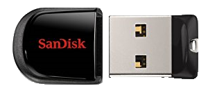
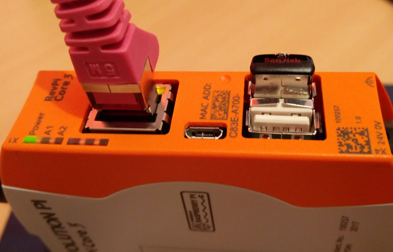

## Prepare USB Stick
Using a memory stick with the Revolution Pi can be a mechanical disaster. So i decided to use a SanDisk Cruzer Fit 32GB USB-Stick USB 2.0.

It is very small and does not rise much over the front of the device. Also the second USB is usable for other things.

Plugged in to an USB port the device is moutend automatically. 

To use the stick as desired we have to reformat it using the EXT4 file system. To do this execte the following steps.

    sudo umount /dev/sda1
    sudo mkfs.ext4 /dev/sda1 -L docker
    sudo mount /dev/sda1 /mnt/pi/docker

**Warning**    
All data on the Stick will be lost.
